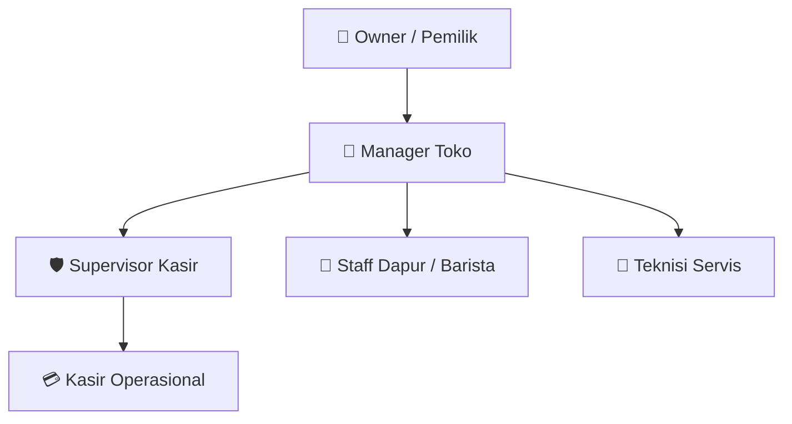
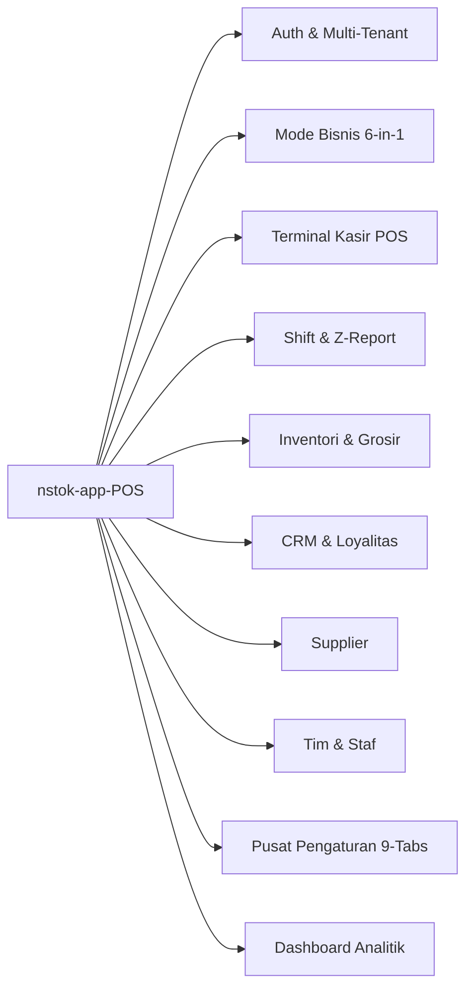
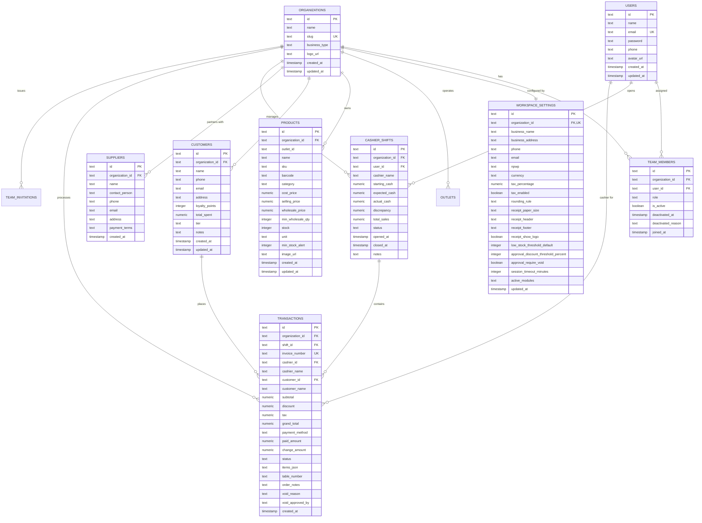

# 📄 PRODUCT REQUIREMENT DOCUMENT (PRD)
## **nstok-APP-pos (v3.0.0)**
### *Next-Gen Multi-Archetype Point of Sale & Cloud Retail Operating System*

---

## 📌 1. Metadata Dokumen

| Atribut | Keterangan |
| :--- | :--- |
| **Nama Dokumen** | Product Requirement Document (PRD) — `nstok-app-pos` |
| **Kode Repositori** | `nstok-APP-pos` |
| **Versi Produk** | `3.0.0` (Generasi ke-3 Host Application) |
| **Status Dokumen** | **Disetujui / Baseline Production** |
| **Klasifikasi** | POS Shell Host Container, Multi-Tenant Architecture |
| **Tech Stack Utama** | Next.js 15 (App Router), React 19, TypeScript, Tailwind CSS, Drizzle ORM, PostgreSQL (Supabase), Lucide Icons |
| **Arsitektur Data** | Dual-Persistence (Offline-First Local Storage + Cloud Sync PostgreSQL) |
| **Target Pengguna** | Pemilik Usaha (Owner), Manajer Toko, Supervisor Kasir, Kasir Operasional, Staff Dapur, Teknisi Bengkel |

---

## 🎯 2. Ringkasan Eksekutif & Latar Belakang

### 2.1. Latar Belakang Masalah
Banyak aplikasi kasir (*Point of Sale*) yang kaku dan hanya dirancang untuk satu vertikal bisnis (hanya ritel atau hanya restoran). Selain itu, ketergantungan penuh pada koneksi internet sering menyebabkan antrean kasir terhenti (*downtime*). Manajemen multi-cabang dan pergantian staf yang sering juga menimbulkan kerentanan keamanan dan kebocoran dana operasional.

### 2.2. Solusi Produk
**`nstok-app-pos`** hadir sebagai sistem kasir pintar multi-tenant dan multi-arketipe bisnis terintegrasi. 
- **1 Akun = 1 Model Bisnis Teradaptasi**: Otomatis menyesuaikan antarmuka dan fitur untuk 6 arketipe usaha (F&B, Retail, Salon, Bengkel/Jasa, Grosir, dan Hybrid).
- **Dual-Persistence Engine**: Beroperasi *offline-first* dengan sinkronisasi otomatis ke cloud database Supabase ketika terhubung internet.
- **Tata Kelola & Keamanan Terpadu**: Dilengkapi otorisasi PIN supervisor untuk tindakan kritis (Void nota & diskon manual) serta penonaktifan staf seketika (*instant offboarding*).

---

## 👥 3. Persona Pengguna & Matriks Hak Akses (RBAC)

### 3.1. Matriks Akses Fitur

| Role | POS Kasir (`/pos`) | Buka/Tutup Shift | Tambah/Ubah Produk | CRM & Supplier | Manajemen Tim (`/team`) | Pengaturan Toko (`/settings`) | Otorisasi Void / Diskon |
| :--- | :---: | :---: | :---: | :---: | :---: | :---: | :---: |
| **OWNER** | ✅ | ✅ | ✅ | ✅ | ✅ (Full) | ✅ (Full) | ✅ |
| **MANAGER** | ✅ | ✅ | ✅ | ✅ | ✅ (Staff) | ✅ (Operasional) | ✅ |
| **SUPERVISOR** | ✅ | ✅ | ✅ | ✅ | 👁️ (Lihat) | ❌ | ✅ (PIN Otorisasi) |
| **KASIR** | ✅ | ✅ | 👁️ (Lihat) | 👁️ (Pilih Member) | ❌ | ❌ | ❌ (Wajib Izin SPV) |
| **STAFF_DAPUR** | ❌ | ❌ | ❌ | ❌ | ❌ | ❌ | ❌ |
| **TEKNISI** | ❌ | ❌ | ❌ | ❌ | ❌ | ❌ | ❌ |

---

## 🚀 4. Spesifikasi Fungsional (Feature Breakdown)

---

### 4.1. Modul Autentikasi & Multi-Tenant Onboarding
1. **Pendaftaran & Pembuatan Organisasi (`/login`)**:
   - Registrasi otomatis menghasilkan entitas `organizations`, `users`, tautan `team_members` dengan role `OWNER`, dan `workspace_settings` default.
2. **Onboarding Pemilihan Arketipe Bisnis (`/business-select`)**:
   - *1 Akun = 1 Mode Bisnis*.
   - Menginisialisasi katalog produk bawaan (*starter template*) dan profil pelanggan awal sesuai bidang bisnis yang dipilih.
3. **Penerimaan Undangan Staf (`/accept-invite`)**:
   - Staf bergabung ke organisasi toko pengundang menggunakan token unik tanpa membuat workspace terpisah.

---

### 4.2. Mesin Arketipe Multi-Bisnis (6-in-1 Adaptive Engine)
Sistem memiliki konfigurasi spesifik untuk 6 model bisnis UMKM:

| Arketipe | Badge | Fitur Unggulan Teraktivasi |
| :--- | :--- | :--- |
| **F&B (Restoran & Kafe)** | `F&B` | Denah / No. Meja, Kitchen Display System (KDS), Split Bill, Catatan Pesanan Khusus. |
| **RETAIL (Minimarket & Toko)** | `Retail` | Barcode Scanner Auto-Focus, Multi-Satuan (`pcs`, `pack`, `dus`), Low Stock Alert. |
| **SALON (Salon & Barbershop)**| `Salon/Spa` | Booking / Appointment, Komisi Stylist/Terapis, Paket Perawatan Khusus. |
| **SERVICES (Bengkel & Servis)**| `Bengkel` | Surat Perintah Kerja (SPK / Work Order), Catatan No. Polisi / IMEI, Estimasi Biaya. |
| **WHOLESALE (Grosir & Agen)** | `Grosir` | Harga Bertingkat Otomatis (*Tiered Wholesale Price*), Term of Payment (TOP), Surat Jalan. |
| **HYBRID (Omni-Channel)** | `Hybrid` | Multi-Warehouse, Sinkronisasi Kanal Online, Manajemen Ekspedisi. |

---

### 4.3. Terminal Kasir Utama (`/pos`)
Antarmuka touchscreen berkecepatan tinggi yang membagi layar menjadi **Etalase Produk (Kiri)** dan **Keranjang & Checkout (Kanan)**:

1. **Etalase & Katalog Produk (`ProductGrid`)**:
   - Pencarian instan (Nama, SKU, atau Barcode).
   - Filter kategori dinamis (*All*, *Makanan*, *Minuman*, *Sembako*, dll.).
   - Tombol shortcut tambah produk kilat (*Quick Add Product Modal*).
2. **Keranjang Belanja Cerdas (`CartSidebar` & `CartContext`)**:
   - Penambahan/pengurangan kuantitas item instan.
   - **Harga Grosir Otomatis**: Jika kuantitas item mencapai ambang `min_wholesale_qty`, harga satuan otomatis beralih ke `wholesale_price`.
   - **Diskon Fleksibel**: Diskon persentase (%) atau nominal rupiah (Rp). Jika diskon melebihi batas toleransi di pengaturan (misal >20%), sistem memicu `SupervisorApprovalModal`.
   - **Nota Gantung (*Hold Bill*)**: Simpan sementara keranjang aktif dengan nomor meja/catatan untuk melayani antrean berikutnya, dan pulihkan kapan saja.
   - **Hubungkan Pelanggan/Member**: Pemilihan member CRM untuk akumulasi poin.
3. **Multi-Metode Pembayaran (`PaymentModal`)**:
   - **Tunai (CASH)**: Tombol uang pas dan pecahan cepat (Rp20.000, Rp50.000, Rp100.000, pembulatan ke atas) serta kalkulator kembalian instan.
   - **QRIS Dinamis**: Tampilan simulasi barcode QRIS standar nasional.
   - **Kartu EDC / Debit-Kredit (CARD)**.
   - **Transfer Bank (TRANSFER)**.
   - **Split Pay (Bayar Sebagian Tunai + Non-Tunai)**.
4. **Cetak Struk Thermal & Digital (`ReceiptModal`)**:
   - Format cetak standar kertas **58mm** dan **80mm** (ESC/POS Bluetooth & USB).
   - Menampilkan Nama Toko, NPWP, Detail Item, Diskon, Pajak PPN, Kembalian, dan No. Meja.
   - Fitur **Kirim Nota via WhatsApp** langsung ke nomor pelanggan dan **Web Print** browser.
5. **Riwayat & Pembatalan Transaksi / Void (`TransactionHistoryModal`)**:
   - Pencarian nota lampau, filter status, dan cetak ulang nota (*reprint*).
   - **Void Nota**: Pembatalan nota yang mewajibkan input alasan pembatalan dan verifikasi PIN Supervisor.

---

### 4.4. Manajemen Shift Kasir & Cash Drawer
1. **Buka Shift (*Starting Float*)**: Input modal awal di laci uang kasir sebelum melayani transaksi.
2. **Pelacakan Penjualan Shift**: Kalkulasi otomatis akumulasi penjualan tunai (*Cash Sales*) vs non-tunai dan estimasi uang di laci (*Expected Cash*).
3. **Tutup Shift (*Z-Report*)**: Input uang fisik aktual di laci kasir (*Actual Cash*), perhitungan otomatis selisih kas (*Discrepancy: Lebih/Kurang*), dan pencetakan ringkasan Z-Report harian.

---

### 4.5. Master Produk & Inventori (`/inventory`)
1. **Manajemen Master Data**: SKU unik, Barcode, Kategori, Satuan (`pcs`, `cup`, `porsi`, dll.), URL Foto.
2. **Kalkulasi Harga & Margin**:
   - Harga Pokok Penjualan / HPP (`cost_price`).
   - Harga Jual Eceran (`selling_price`).
   - Harga Jual Grosir (`wholesale_price`) dan Qty Minimum Grosir (`min_wholesale_qty`).
3. **Pemantauan Stok Real-Time**:
   - Indikator peringatan stok menipis (*Low Stock Alert*).
   - Pengurangan stok otomatis (*auto-deduct*) setiap transaksi diselesaikan di kasir.

---

### 4.6. CRM & Program Loyalitas Pelanggan (`/customers`)
1. **Master Profil Pelanggan**: Nama, Telepon/WhatsApp, Email, Alamat, Catatan.
2. **Tingkatan Keanggotaan (*Membership Tiers*)**: `BRONZE`, `SILVER`, `GOLD`.
3. **Akumulasi Poin & Belanja**: Pencatatan otomatis total belanja seumur hidup (*Lifetime Spent*) dan saldo poin loyalitas.

---

### 4.7. Manajemen Pemasok / Vendor (`/suppliers`)
1. **Master Data Supplier**: Nama Perusahaan, Contact Person (PIC), Telepon, Email, Alamat.
2. **Syarat Pembayaran (*Payment Terms*)**: Cash on Delivery (COD), TOP 7 Hari, TOP 14 Hari, TOP 30 Hari.

---

### 4.8. Manajemen Tim & Staf Toko (`/team`)
1. **Pendaftaran Staf**: Tambah akun staf langsung dengan penugasan Role (Kasir, Supervisor, Manager, Dapur, Teknisi).
2. **Pemberhentian Staf Seketika (*Instant Offboarding*)**: Toggle aktif/nonaktif akun staf untuk memblokir akses login seketika dengan proteksi validasi shift kasir aktif.

---

### 4.9. Pusat Kendali Pengaturan Terpadu 9-Tabs (`/settings`)

| Tab | Nama Tab | Konfigurasi Utama |
| :---: | :--- | :--- |
| **1** | **Profil Bisnis** | Nama Usaha, Alamat, Telepon, Email, NPWP, Logo Toko. |
| **2** | **Outlet & Cabang** | Nama Outlet, Jam Buka Operasional, Penanda Outlet Utama. |
| **3** | **Pajak & Mata Uang** | Toggle PPN Aktif/Nonaktif, Tarif Pajak (%), Simbol Mata Uang, Aturan Pembulatan (*None, Up 100, Nearest 100*). |
| **4** | **Struk & Cetak** | Ukuran Kertas (58mm/80mm), Pesan Header/Footer, Toggle Logo di Struk. |
| **5** | **Staff & Role** | Ringkasan dan shortcut akses ke manajemen staf. |
| **6** | **Approval & Keamanan** | Batas Diskon Bebas Kasir (%), Wajibkan Otorisasi Supervisor untuk Void (True/False), Session Timeout (Menit). |
| **7** | **Notifikasi** | Notifikasi stok menipis dan rekap harian shift. |
| **8** | **Modul Bisnis** | Toggle aktivasi submodul operasional toko. |
| **9** | **Data & Sinkronisasi** | Status Sinkronisasi Supabase Cloud DB, Paksa Sinkronisasi, Ekspor Backup Database JSON. |

---

### 4.10. Dashboard Analitik & Ringkasan Eksekutif (`/dashboard`)
1. **Kartu Metrik KPI**: Total Omzet (Rp), Total Nota Transaksi, Total Member, Total Item Produk.
2. **Live Feed Transaksi**: Tabel transaksi real-time dengan status pembayaran dan metode bayar.
3. **Peringatan Operasional**: Pemantauan cepat barang dengan stok di bawah batas aman.

---

## 🗄️ 5. Arsitektur & Skema Database

Sistem menggunakan **PostgreSQL (Supabase)** yang dikelola dengan **Drizzle ORM** dan layer eksekusi DDL self-healing otomatis saat startup.

### 5.1. Entity Relationship Diagram (ERD)

---

### 5.2. Kamus Data Tabel (Database Data Dictionary)

#### 1. Tabel `organizations`
- `id` (TEXT, PK): UUID organisasi/workspace toko.
- `name` (TEXT, NOT NULL): Nama badan usaha toko.
- `slug` (TEXT, UNIQUE): Identifier URL unik toko.
- `business_type` (TEXT, NOT NULL): Nilai enum (`RETAIL`, `FNB`, `SERVICES`, `SALON`, `WHOLESALE`, `HYBRID`).
- `logo_url` (TEXT): Tautan URL logo toko.
- `created_at`, `updated_at` (TIMESTAMP WITH TIME ZONE).

#### 2. Tabel `users`
- `id` (TEXT, PK): UUID pengguna.
- `name` (TEXT, NOT NULL): Nama staf.
- `email` (TEXT, NOT NULL, UNIQUE): Email login staf.
- `password` (TEXT, NOT NULL): Hash kata sandi akun.
- `phone` (TEXT): Nomor telepon staf.
- `avatar_url` (TEXT): Foto profil staf.
- `created_at`, `updated_at` (TIMESTAMP WITH TIME ZONE).

#### 3. Tabel `team_members`
- `id` (TEXT, PK): UUID relasi tim.
- `organization_id` (TEXT, FK -> `organizations.id`): Toko tempat staf bekerja.
- `user_id` (TEXT, FK -> `users.id`): Akun staf.
- `role` (TEXT, NOT NULL): Enum (`OWNER`, `MANAGER`, `SUPERVISOR`, `KASIR`, `STAFF_DAPUR`, `TEKNISI`).
- `is_active` (BOOLEAN, NOT NULL, DEFAULT TRUE): Status aktif akun kerja.
- `deactivated_at` (TIMESTAMP WITH TIME ZONE): Waktu nonaktif.
- `deactivated_reason` (TEXT): Alasan penonaktifan.
- `joined_at` (TIMESTAMP WITH TIME ZONE).

#### 4. Tabel `team_invitations`
- `id` (TEXT, PK): UUID undangan.
- `organization_id` (TEXT, FK -> `organizations.id`).
- `email` (TEXT, NOT NULL): Email staf yang diundang.
- `role` (TEXT, NOT NULL): Role yang akan diberikan.
- `token` (TEXT, NOT NULL, UNIQUE): Token unik verifikasi undangan.
- `status` (TEXT, NOT NULL, DEFAULT 'PENDING'): Enum (`PENDING`, `ACCEPTED`, `EXPIRED`, `REVOKED`).
- `invited_by_user_id` (TEXT, FK -> `users.id`).
- `expires_at`, `created_at` (TIMESTAMP WITH TIME ZONE).

#### 5. Tabel `workspace_settings`
- `id` (TEXT, PK): UUID pengaturan.
- `organization_id` (TEXT, FK -> `organizations.id`, UNIQUE): Relasi 1-to-1 dengan toko.
- `business_name` (TEXT, NOT NULL): Nama usaha pada nota kasir.
- `business_address`, `phone`, `email`, `npwp` (TEXT): Data legalitas & kontak toko.
- `currency` (TEXT, DEFAULT 'IDR'): Mata uang yang digunakan.
- `tax_percentage` (NUMERIC(5,2), DEFAULT 0.00): Nilai persentase PPN.
- `tax_enabled` (BOOLEAN, DEFAULT FALSE): Toggle pengenaan pajak.
- `rounding_rule` (TEXT, DEFAULT 'NONE'): Aturan pembulatan (`NONE`, `UP_100`, `NEAREST_100`).
- `receipt_paper_size` (TEXT, DEFAULT '58mm'): Format cetak (`58mm` atau `80mm`).
- `receipt_header`, `receipt_footer` (TEXT): Pesan khusus pada struk.
- `receipt_show_logo` (BOOLEAN, DEFAULT TRUE): Opsi cetak logo pada struk.
- `low_stock_threshold_default` (INTEGER, DEFAULT 5): Ambang batas peringatan stok tipis.
- `approval_discount_threshold_percent` (INTEGER, DEFAULT 20): Batas diskon kasir sebelum butuh otorisasi supervisor.
- `approval_require_void` (BOOLEAN, DEFAULT TRUE): Wajibkan PIN SPV untuk Void nota.
- `session_timeout_minutes` (INTEGER, DEFAULT 525600): Waktu *auto-lock* sesi kasir (1 Tahun / 365 Hari / 525.600 Menit).
- `active_modules` (TEXT, DEFAULT '[]'): JSON array daftar modul aktif.
- `updated_at` (TIMESTAMP WITH TIME ZONE).

#### 6. Tabel `outlets`
- `id` (TEXT, PK): UUID outlet.
- `organization_id` (TEXT, FK -> `organizations.id`).
- `name` (TEXT, NOT NULL): Nama cabang outlet.
- `address`, `phone`, `opening_hours` (TEXT).
- `is_main` (BOOLEAN, DEFAULT FALSE): Penanda cabang pusat.
- `created_at` (TIMESTAMP WITH TIME ZONE).

#### 7. Tabel `products`
- `id` (TEXT, PK): UUID produk.
- `organization_id` (TEXT, FK -> `organizations.id`).
- `outlet_id` (TEXT): ID outlet terkait.
- `name` (TEXT, NOT NULL): Nama produk barang/jasa.
- `sku` (TEXT, NOT NULL): Kode SKU unik.
- `barcode` (TEXT): Kode barcode barang.
- `category` (TEXT, DEFAULT 'Umum'): Kategori produk.
- `cost_price` (NUMERIC(12,2), DEFAULT 0): HPP produk.
- `selling_price` (NUMERIC(12,2), NOT NULL): Harga jual eceran.
- `wholesale_price` (NUMERIC(12,2)): Harga grosir satuan.
- `min_wholesale_qty` (INTEGER, DEFAULT 10): Syarat minimum qty harga grosir.
- `stock` (INTEGER, DEFAULT 0): Sisa stok fisik.
- `unit` (TEXT, DEFAULT 'pcs'): Satuan produk.
- `min_stock_alert` (INTEGER, DEFAULT 5): Peringatan stok minimum per produk.
- `image_url` (TEXT): Foto produk.
- `created_at`, `updated_at` (TIMESTAMP WITH TIME ZONE).

#### 8. Tabel `customers`
- `id` (TEXT, PK): UUID pelanggan.
- `organization_id` (TEXT, FK -> `organizations.id`).
- `name` (TEXT, NOT NULL): Nama pelanggan.
- `phone` (TEXT, NOT NULL): Nomor telepon/WA.
- `email`, `address` (TEXT).
- `loyalty_points` (INTEGER, DEFAULT 0): Akumulasi poin member.
- `total_spent` (NUMERIC(14,2), DEFAULT 0): Total pengeluaran belanja (Rp).
- `tier` (TEXT, DEFAULT 'BRONZE'): Enum (`BRONZE`, `SILVER`, `GOLD`).
- `notes` (TEXT): Catatan khusus pelanggan.
- `created_at`, `updated_at` (TIMESTAMP WITH TIME ZONE).

#### 9. Tabel `suppliers`
- `id` (TEXT, PK): UUID pemasok.
- `organization_id` (TEXT, FK -> `organizations.id`).
- `name` (TEXT, NOT NULL): Nama vendor/distributor.
- `contact_person`, `phone`, `email`, `address` (TEXT).
- `payment_terms` (TEXT, DEFAULT 'Cash'): Syarat tempo pembayaran.
- `created_at` (TIMESTAMP WITH TIME ZONE).

#### 10. Tabel `cashier_shifts`
- `id` (TEXT, PK): UUID sesi shift.
- `organization_id` (TEXT, FK -> `organizations.id`).
- `user_id` (TEXT, FK -> `users.id`): ID kasir yang bertugas.
- `cashier_name` (TEXT, NOT NULL): Nama kasir.
- `starting_cash` (NUMERIC(12,2), DEFAULT 0): Modal awal kasir (Rp).
- `expected_cash` (NUMERIC(12,2), DEFAULT 0): Estimasi uang akhir di laci kasir.
- `actual_cash` (NUMERIC(12,2)): Uang kas fisik aktual saat tutup shift.
- `discrepancy` (NUMERIC(12,2)): Selisih uang kasir (Lebih/Kurang).
- `total_sales` (NUMERIC(14,2), DEFAULT 0): Akumulasi omzet selama shift.
- `status` (TEXT, DEFAULT 'OPEN'): Enum (`OPEN`, `CLOSED`).
- `opened_at`, `closed_at` (TIMESTAMP WITH TIME ZONE).
- `notes` (TEXT): Catatan serah terima kasir.

#### 11. Tabel `transactions`
- `id` (TEXT, PK): UUID transaksi.
- `organization_id` (TEXT, FK -> `organizations.id`).
- `shift_id` (TEXT, FK -> `cashier_shifts.id`).
- `invoice_number` (TEXT, NOT NULL, UNIQUE): Nomor faktur unik (misal `INV-902182`).
- `cashier_id` (TEXT, FK -> `users.id`), `cashier_name` (TEXT, NOT NULL).
- `customer_id` (TEXT, FK -> `customers.id`), `customer_name` (TEXT).
- `subtotal` (NUMERIC(14,2), NOT NULL): Total sebelum diskon & pajak.
- `discount` (NUMERIC(14,2), DEFAULT 0): Nilai diskon yang diaplikasikan.
- `tax` (NUMERIC(14,2), DEFAULT 0): Nilai pajak PPN.
- `grand_total` (NUMERIC(14,2), NOT NULL): Total akhir tagihan nota.
- `payment_method` (TEXT, NOT NULL): Enum (`CASH`, `QRIS`, `CARD`, `TRANSFER`, `SPLIT`).
- `paid_amount` (NUMERIC(14,2), NOT NULL): Jumlah uang yang dibayarkan.
- `change_amount` (NUMERIC(14,2), DEFAULT 0): Nilai kembalian uang kasir.
- `status` (TEXT, DEFAULT 'COMPLETED'): Enum (`COMPLETED`, `VOIDED`, `HOLD`).
- `items_json` (TEXT, NOT NULL): Snapshot JSON seluruh item yang dibeli.
- `table_number`, `order_notes` (TEXT): Data meja & catatan khusus F&B.
- `void_reason`, `void_approved_by` (TEXT): Log alasan dan supervisor otorisasi jika nota dibatalkan.
- `created_at` (TIMESTAMP WITH TIME ZONE).

---

## ⚡ 6. Kebutuhan Non-Fungsional (NFR)

1. **Performa Checkout**:
   - Respon penambahan produk ke keranjang `< 50ms`.
   - Proses kalkulasi grand total dan pembulatan pajak instan secara asinkron.
2. **Keandalan & Offline Resilience**:
   - Jika jaringan internet terputus, kasir tetap dapat melakukan checkout 100% menggunakan `localStorage` tanpa hambatan.
   - Saat koneksi pulih, background task secara otomatis menyinkronkan data lokal ke PostgreSQL Supabase.
3. **Keamanan & Isolasi Data**:
   - Sandi staf di-hash sebelum disimpan.
   - Seluruh kueri data terisolasi berdasarkan `organization_id`.
   - Aksi berisiko tinggi (diskon besar, pembatalan transaksi / void) dilindungi otorisasi PIN Supervisor.
4. **Kompatibilitas Perangkat Keras**:
   - Mendukung printer thermal ESC/POS (kertas 58mm dan 80mm).
   - Mendukung hardware USB/Bluetooth Barcode Scanner.
   - Tampilan adaptif untuk tablet 10-inch, terminal POS desktop, dan smartphone.

---

## 🗺️ 7. Struktur File & Sumber Daya Kode

| Modul / Domain | Lokasi File Implementasi |
| :--- | :--- |
| **Database Schema Drizzle** | [`src/db/schema.ts`](src/db/schema.ts) |
| **Database Client & DDL Migrations** | [`src/db/index.ts`](src/db/index.ts) |
| **Server Actions & Cloud Sync** | [`src/app/actions/cloud-sync.ts`](src/app/actions/cloud-sync.ts) |
| **Terminal Kasir View** | [`src/app/pos/page.tsx`](src/app/pos/page.tsx) |
| **Keranjang & Billing Context** | [`src/context/CartContext.tsx`](src/context/CartContext.tsx) |
| **Shift Kasir Context** | [`src/context/ShiftContext.tsx`](src/context/ShiftContext.tsx) |
| **Auth & RBAC Context** | [`src/context/AuthContext.tsx`](src/context/AuthContext.tsx) |
| **Pengaturan Toko View (9-Tabs)** | [`src/app/settings/page.tsx`](src/app/settings/page.tsx) |
| **Manajemen Inventori View** | [`src/app/inventory/page.tsx`](src/app/inventory/page.tsx) |
| **CRM Pelanggan View** | [`src/app/customers/page.tsx`](src/app/customers/page.tsx) |
| **Manajemen Supplier View** | [`src/app/suppliers/page.tsx`](src/app/suppliers/page.tsx) |
| **Manajemen Tim Staf View** | [`src/app/team/page.tsx`](src/app/team/page.tsx) |
| **Dashboard Analitik View** | [`src/app/dashboard/page.tsx`](src/app/dashboard/page.tsx) |
| **Onboarding Mode Bisnis View** | [`src/app/business-select/page.tsx`](src/app/business-select/page.tsx) |
